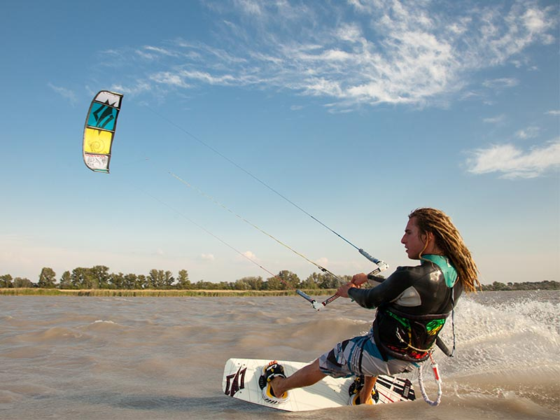

# HackerDome.xyz || #hackerdome

Hackerdome will be one of very first **true** [hackerhouse residency ](https://wiki.hackerspaces.org/Hackbase) [(coliving)](https://en.wikipedia.org/wiki/Coliving)

[Located in Central Europe, Bratislava, Slovakia](https://www.google.com/maps?q=Central+Europe,+Bratislava,+Slovakia)

Affiliated with local hackerspace [Progressbar](https://progressbar.sk)
* also friends at [Base48](http://base48.cz) & [ParalelniPolis](https://www.paralelnipolis.cz/en/)

*Now WorkInProgress, opening 2016/2017, but contact me for beta-run*

### Features
* Fast Internet (500Mbit/30Mbit)
  * IPFS local nodes
  * Tor relays
  * anonymous encrypted exits to internet

* Free
  * Club-Mate (20mg/100ml)
  * Flora-Power (18mg/100ml)
  * Nootropics (??? :D)
  * [Synectar.sk](http://synectar.sk/en/) (local soylent)

* Full-stack kitchen
* Located near woods
* Pet-friendly space
* Shared (e)car & (e)bike (**e** part is planned)
* [Near is community garden](https://www.facebook.com/projekt.zivot/photos_stream)

### Trips locations near hackerdome
* Local Bratislava *hidden* locations
  * http://mpba.sk/

* Sky walk (Stezka v oblacich) (~160mins car)
  * https://www.youtube.com/watch?v=oYMlsBFDKuk
  * https://www.facebook.com/stezkavoblacich

* [Neusiedler See](https://www.google.com/maps/place/Lake+Neusiedl/@47.8033419,16.7010148,12z/data=!3m1!4b1!4m2!3m1!1s0x476c3ffe58617d7d:0xea246ea46ba19a1e) (~30mins car)
  * [Windsurfing / Kitesurfing Podersdorf Am See See](https://www.google.com/maps/place/7141+Podersdorf+am+See,+Austria/@47.8544268,16.8229922,15z/data=!3m1!4b1!4m2!3m1!1s0x476c6a3879b6aaeb:0xf86d1b10b6c12da7)

* [Bikepark Koliba](http://bikeparkkoliba.sk/?lang=en) (~10min on bike)
  * [two trails](http://bikeparkkoliba.sk/wp-content/gallery/trat-rohatka/mapa-bikepark-koliba.jpg) (map)
  * w/ chair lift

* [Devin Castle](https://www.google.sk/search?q=devin+castle) (~20min by car)
  * near is [Sandberg](https://sk.wikipedia.org/wiki/Sandberg)

  * near is "Weiterov Lom"

* Urban Exploration
  * [Near Bratislava UE spots](https://picasaweb.google.com/102795408576830141009)
  * Razsochy (unfinished hospital from 80s) (~10mins walk)
    * https://www.youtube.com/watch?v=t_5yp0tkm-8 (Aerial)
    * https://www.youtube.com/watch?v=Kf5scmfHSvg
    * https://www.youtube.com/watch?v=U-d6e4DiLaM
    * https://www.youtube.com/watch?v=5YjjKaXGfoI

  * Unfinished waterworks from 1970 over the Old Lamač at the place of former quarry (15mins walk)
    * http://mpba.sk/en/650
    * https://www.facebook.com/media/set/?set=a.1738304743069345.1073741837.1737418699824616&type=3
    * https://www.youtube.com/watch?v=VC34vPyRftc

  * Rocket military base built in 80ties of the 20th century. (~40mins bike)
    * Top of [Devínska Kobyla](https://en.wikipedia.org/wiki/Dev%C3%ADnska_Kobyla). Its peak elevation is 514 m AMSL
    * rocket system ground – air S 125 Neva, known as SA-3 GOA.
    System was developed by company Lavočkin & Gruškin OKB and manufactered by  Fakel MKB.
    * 20 objects in area

### Local community groups

* [Meetup groups in Bratislava](http://www.meetup.com/cities/sk/bratislava/)
* Technology
  * [Rubyslava](http://rubyslava.sk/)
  * [Webelement](https://webelement.sk/)
  * [Nodeschool Bratislava](https://github.com/nodeschool/bratislava)
  * Node.js meetup
  * [IPFS meetup](http://www.meetup.com/Bratislava-IPFS-Meetup/)

* Bike  
  * [Mayor independent community working on development bike conditions - Cyklokoalicia](http://cyklokoalicia.sk/)
  * [Critical Mass Bratislava](https://www.facebook.com/criticalmassba/)
  * [White Bikes - community bike renting](http://whitebikes.info/)

* Media/Art
  * [A4 – SPACE FOR CONTEMPORARY CULTURE](http://www.a4.sk/)
  * [FUGA](https://www.facebook.com/fuga.ba/)
  * [Cvernovka](http://www.cvernovka.com/)

* Fablabs
  * [Fablab.sk](http://www.fablab.sk/en/)
  * Lab - in old market hall (Q1 2016)

### Goodies

* Tesco 24/7 (5min bike)
* Gas station 24/7 (5min bike)
* McDonalds 24/7 (5min bike/2min car)
* Kaufland 10-22 (10min walk)

### Equipment

* Standing desk [Skarsta](http://www.ikea.com/us/en/catalog/products/S29084966/)
* Lot of pallets (let's build something?!)

### City Transportation

* We got Uber & Liftago (yay!, costs like 3-7€ to Downtown)
* By bus, you are in Downtown in 12 mins, costs like 0.70€
  * [Bus stop Húščavova](http://imhd.sk/ba/schedule-timetable/stop/2771/Huscavova) (7min walk)
  * [Bus stop Pridánky](http://imhd.sk/ba/schedule-timetable/stop/2400/Pridanky) (5min walk)
  * Night buses (every hour)
    * [N21 from Central Railway Station](http://imhd.sk/ba/schedule-timetable/linka/N21/smer/Devinska-Nova-Ves/zastavka/Hlavna-stanica-Central-Railway-Station/629145695259)
    * [N37 from Central Railway Station](http://imhd.sk/ba/schedule-timetable/linka/N37/smer/Zahorska-Bystrica/zastavka/Hlavna-stanica-Central-Railway-Station/419430495249)
* By bike you are in Downtown in 20mins

### Cities near

* Vienna, Austria (1 hour by car/train)
* Brno, Czech Republic (1 hour by car/train)
* Budapest, Hungary (2 hours by car/train)
* Prague, Czech Republic (3 hours by car/train)

### Options to stay
* Micro-term
  * staying for like hackercouch, 1-3 days
  * just support us buying club-mate at place, you are welcome!

* Mid-term
  * Plan to stay for 1-12 weeks, great! :)
  * Get in touch with local community

* Long-term
  * 12+ weeks
  * So you really like Bratislava, noice :)

### Do you want in?

We accept payments in Bitcoin, Ethereum and also in analog money.

### Who I'm

Founder of [Progressbar](https://progressbar.sk). It all started before summer 2010 :)

* [Facebook Matej 'wao' Nemček](https://www.facebook.com/matej.satoshi)
* [Twitter @yangwao](https://twitter.com/YangWao)
* [Instagram @yangwao](https://www.instagram.com/yangwao/)
* [Reddit jangwao](https://www.reddit.com/user/jangwao/)
* [Linkedin](https://www.linkedin.com/in/mnemcek)

### Contact

* [Ask me something about HackerDome](https://github.com/yangwao/hackerdome.xyz/issues/new) at Github
* [join IRC #hackerdome @ Freenode](irc://chat.freenode.net/hackerdome) or [use webchat](http://webchat.freenode.net/?channels=%23hackerdome)
* Keep in touch, yangwao at freenode or try catch me ybdaba at gmail dot com

### Some clickings
* [Mobile hackbase Apollo NG](https://apollo.open-resource.org/)
* http://hackercouch.com/
* https://wiki.hackerspaces.org/Exchanges
* https://wiki.hackerspaces.org/Hackbase
* http://totalism.org/alike
* http://totalism.org/maps
* https://wiki.hackerspaces.org/infinity
  * http://hillhacks.in/index
  * http://hillhacks.in/unconference
* http://techsquat.com/ (in Czech Republic Brno & Prague)
* https://wiki.techinc.nl/index.php/User:Becha/Lika#2016
* http://opendoor.io/
* https://www.wework.com/
* https://nomadhouse.io/
* http://www.thecaravanserai.co/preview
* http://coconat-space.com/work/
* http://www.shareable.net/blog/6-coliving-networks-reinventing-home

### Why Geodesic dome

#### Authors
* [Buckminister Fuller](https://en.wikipedia.org/wiki/Buckminster_Fuller)
* [Walther Bauersfeld](https://en.wikipedia.org/wiki/Walther_Bauersfeld)

* [the largest indoor rainforest in the world (Project Eden)](https://www.edenproject.com/)

### Crazy shit in end

[BuckMinster Fuller Meets Transformers](http://architizer.com/blog/buckminster-fuller-robot/)

[If IPFS has some troubles, here is latest revision](https://github.com/yangwao/hackerdome.xyz/blob/master/README.md)
